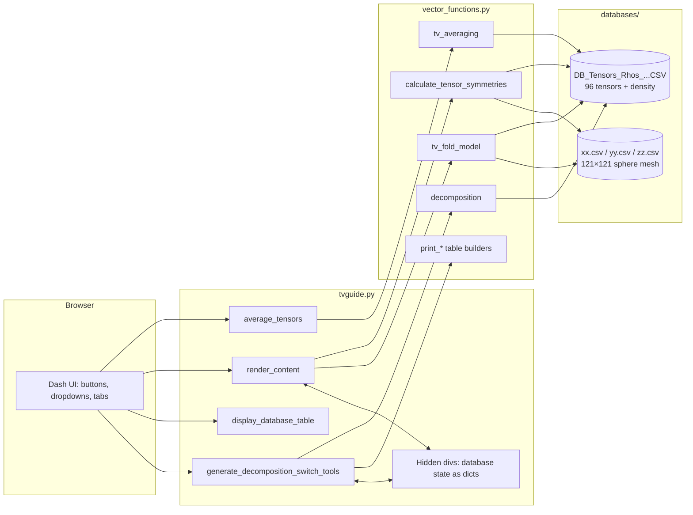

# TVGuide-Aniso — Code Overview

**TVGuide-Aniso** ("Tensor Visualization Guide") is a Plotly Dash web application for exploring the
elastic stiffness tensors of rocks and the seismic anisotropy they produce. It bundles a database of
96 published elastic tensors, lets users add their own, and offers four analysis tools: velocity
visualization, tensor averaging, a fold model, and symmetry decomposition. It is a Python port of a
MATLAB workflow (`ChristoffelPlotDEV.m`, referenced in a comment at the bottom of `tvguide.py`).

This document explains what the two main source files do and how the pieces fit together.

---

## 1. Architecture at a glance



| File | Role |
|---|---|
| `tvguide.py` | Dash app: layout, four callbacks, UI state plumbing |
| `vector_functions.py` | All numerics and Plotly figure construction (~3,700 lines) |
| `ChristoffelDevParams.py` | Small parameter class (CSV column names, resolution constants) |
| `appSelectionOptions.py` | Leftover options class from an earlier map-based app; only `tensor_addition_list_allowed` is relevant |
| `databases/DB_Tensors_Rhos_OrigOrientation_CSV.csv` | 96 published tensors: paper reference, rock type, density, C11–C66 |
| `databases/xx.csv`, `yy.csv`, `zz.csv` | Precomputed 121×121 grid of unit-sphere direction vectors (from MATLAB's `sphere`) |
| `assets/` | Stylesheets (auto-served by Dash) and CIRES/NOAA logos |
| `build.sh` / `run.sh` | Conda/mamba environment bootstrap and gunicorn launcher |

---

## 2. `tvguide.py` — the Dash application

### 2.1 Setup and layout

The module creates the Dash app, then builds a single-page layout out of two blocks: a fixed
`navbar` (Database toggle button, "Enter Your Own Tensor" button, sponsor logos) and a `body` with:

- **Tool buttons** — Visualize Velocities, Average Tensors, Calculate Fold Model, Decompose Tensors.
  Only one tool's option panel is visible at a time; the rest are hidden with `display:none`.
- **Per-tool option panels** — tensor dropdowns and a submit button for each tool. The averaging
  panel has five tensor dropdowns and five weight inputs, of which only the first N are shown.
- **The database table** — built by `vector_functions.print_csv_table()` as an editable, exportable
  `dash_table.DataTable`, toggled by the navbar button.
- **Custom tensor input** — a text field expecting 22 comma/tab/space-separated numbers:
  density first, then the 21 independent Cij values.
- **Two tab strips** — 12 velocity-plot tabs (`tabs-div`) and 10 fold-model tabs
  (`fold-model-tabs-div`), generated from the `velocity_tab_labels` / `fold_tab_labels` lists.
- **Graph containers** — `graph-display` for velocity plots, `fold-model-display` for fold plots.

**State lives in hidden divs.** Dash callbacks are stateless, so the current database (original 96
rows plus any user-added tensors) is serialized as a dict and parked in hidden divs
(`database_dataframe`, `database_dataframe_user_input`, `database_dataframe_user_averaging_input`).
Callbacks read it back via `State(...)` and `vector_functions.returnUserInputDataFrame()` rebuilds a
DataFrame from the dict. (The modern equivalent would be a single `dcc.Store`.)

**Tensor numbering.** Database tensors are numbered 1–96. User-added tensors get numbers 97–121.
Every callback distinguishes the two with `tensor >= 97` (`FIRST_USER_TENSOR`): database tensors are
looked up in the CSV, user tensors in the hidden-div DataFrame.

### 2.2 Callback: `average_tensors`

Fires on "Submit Average Tensors Options". Collects the selected tensor numbers and weights,
dispatches to `vector_functions.tv_averaging(...)` — routing through the user-input variant if any
selected tensor is a user tensor — and writes the resulting 36-element averaged stiffness matrix
into the `v_ave_1` text field as a comma-separated string.

### 2.3 Callback: `render_content`

The plot dispatcher. Two lookup tables map each tab to a plot-type string and a 2D/3D flag:

```python
TAB_PLOT_TYPES  = {'tab-2': ('VP', False), 'tab-8': ('3DVS2', True), ...}
FOLD_TAB_PLOT_TYPES = {'fold-model-tab-3': ('VS1', False), ...}
```

If the trigger was a fold-model tab, it calls `tv_fold_model`; otherwise (velocity tab, Submit
Tensor, or initial page load) it calls `calculate_tensor_symmetries`, defaulting to the Vp tab.
Both receive the tensor number, the user/database flag, the plot type in the right slot, and the
user DataFrame. The returned Plotly figure lands in `graph-display` (velocities) or is wrapped in a
`dcc.Graph` inside `fold-model-display` (fold model).

### 2.4 Callback: `display_database_table`

Toggles the database table's visibility on the navbar button — odd click counts show it, even hide it.

### 2.5 Callback: `generate_decomposition_switch_tools`

The workhorse callback (~45 outputs). It handles four loosely related jobs:

1. **Tool switching** — for each tool button, sets the `display` style of every panel, tab strip,
   and graph container, and updates the "Current Tool:" title.
2. **Decomposition** — runs `vector_functions.decomposition(...)` for the selected tensor and feeds
   the four result tables (percentage breakdown, isotropic, hexagonal, orthorhombic components).
   Sub-buttons choose which of the four tables is visible.
3. **Custom tensor ingestion** — on "Submit Input Tensor", parses the 22-value string, validates the
   count (showing a warning if it isn't exactly 22), assigns the next free number ≥ 97, appends the
   row to the DataTable and the hidden-div DataFrame, and adds the new number to all seven tensor
   dropdowns.
4. **Averaging-panel sizing** — shows/hides tensor dropdowns 3–5 and weight inputs 3–5 based on the
   "number of tensors to average" selection.

It also lets you push a decomposition result back into the database: "Submit Decomposition" appends
the orthorhombic-component tensor as a new user tensor labelled "Decomposed Orthorhombic Tensor".

---

## 3. `vector_functions.py` — the numerics

Every top-level function follows the same preamble: load the tensor database (CSV or the user
DataFrame passed down from the hidden div), pick the requested row, rebuild the symmetric 6×6
stiffness matrix from the 21 stored components, and grab the density.

### 3.1 `calculate_tensor_symmetries(tensor_index, user_input, plotType, plotType3D, userInputDataFrame)`

The core Christoffel solver plus all velocity plotting. Steps:

1. **Direction grid.** Reads `xx/yy/zz.csv` — a 121×121 mesh of unit vectors covering the sphere,
   precomputed in MATLAB so the Python port samples exactly the same directions.
2. **Christoffel loop.** For each of the 121×121 directions, builds the 3×3 Christoffel matrix `T`
   using a Voigt index lookup table, forms `TT = T·Tᵀ`, and eigen-decomposes `TT`. Because `T` is
   symmetric, the eigenvalues of `TT` are the squares of those of `T` — guaranteeing they are
   non-negative — hence the double square root in
   `v = sqrt(sqrt(eig(TT))/ρ) * 10` (km/s). Eigenvalues sorted ascending give Vs2, Vs1, Vp and
   their polarization vectors.
3. **Isotropic reference.** Computes Voigt and Reuss bounds of the bulk (K) and shear (G) moduli
   from `C` and its inverse `S`, averages them (Voigt-Reuss-Hill), and derives isotropic Vp, Vs and
   Vp/Vs for comparison.
4. **Projection.** Maps each direction to the plane with the Lambert-style transform
   `x' = x·sqrt(1/(1−z))`, `y' = y·sqrt(1/(1−z))` (lower hemisphere dropped), then interpolates the
   scattered velocity values onto a regular 201×201 grid with `scipy.interpolate.griddata`.
5. **Plotting.** One branch per plot type:
   - **`Quiver`** — the Vs1 polarization plot: a contour map of splitting time
     (`1/Vs2 − 1/Vs1`, s/km) overlaid with a quiver field of Vs1 polarization vectors
     (toggleable via the legend).
   - **`VP`, `VS1`, `VS2`, `VPVS1`** — stereographic contour maps of the respective velocity (or
     ratio), annotated with max/min. Oversized white marker traces are drawn on top to mask the
     square interpolation grid outside the projection circle.
   - **`BackAzimuthal`** — selects directions in the horizontal plane (|z| < 0.001), computes each
     one's backazimuth, and scatters Vs1 and Vs2 against it, colored by the polarization's
     inclination from horizontal on a red-blue scale.
   - **`RadialPlots`** — radial/polar renderings of the same velocity fields.
   - **`3DQuiver`** — a 3D sphere surface colored by splitting time with paired `go.Cone` traces
     showing ± Vs1 polarization directions.
   - **`3DVP`, `3DVS1`, `3DVS2`, `3DVPVS1`** — 3D sphere surfaces colored by the velocity value.

### 3.2 `tv_fold_model(...)` — effective anisotropy of a folded layer

Simulates what a seismic wave would "see" through a folded rock layer:

1. **Fold geometry.** A sine wave (amplitude 25, period 4) over −180°…180°, sampled at 100 stations.
   The local dip at each station comes from the slope (`arctan` of the numerical derivative);
   trend is fixed at 90°, strike at 0°, and a rake angle is derived per station.
2. **Tensor rotation.** For each station, builds the 6×6 **Bond transformation matrices** (the
   Voigt-notation equivalents of 3×3 rotations) for rake, x, y and z, and rotates the stiffness
   matrix: `C' = R·C·Rᵀ` applied in sequence. This yields 100 rotated copies of the tensor, one per
   position along the fold.
3. **Homogenization.** Averages the 100 rotated stiffness matrices (Voigt bound) and the 100
   inverted compliance matrices (Reuss bound), then takes `VRH = (V + R⁻¹)/2` — the effective
   medium for the whole fold.
4. **Same pipeline as 3.1.** Runs the Christoffel loop and produces the same family of 2D/3D plots
   for the effective tensor.

### 3.3 `tv_averaging(t1..t5, user_input, userInputDataFrame, weight)`

Weighted Voigt-Reuss averaging of 2–5 database/user tensors — the standard way to estimate a
composite rock from mineral constituents. Weights are normalized to sum to 1; the Voigt average is
the weighted mean of the stiffness matrices, the Reuss average the weighted mean of the
pseudo-inverted compliances. Returns the Voigt average rounded to 4 decimals (as the 36-element
list shown in the UI) plus the Reuss matrix.

### 3.4 `decomposition(tensor_index, ...)` — symmetry decomposition (Browaeys & Chevrot style)

Decomposes an arbitrary 21-component tensor into contributions from the elastic symmetry classes:

1. **Find the natural coordinate frame.** Builds the 3×3 dilatational matrix `d_ij` and Voigt
   matrix `v_ij` (contractions of C), eigen-decomposes both, and constructs bisectrix vectors
   between their eigenvector pairs — candidate symmetry axes. All six axis orderings are tried.
2. **Rotate C into that frame.** Uses the same 6×6 Bond matrix `K` construction as the fold model:
   `C' = K·C·Kᵀ`.
3. **Project onto symmetry subspaces.** Expresses `C'` as the 21-component Browaeys-Chevrot vector
   (with √2 and 2 weights that make the Euclidean norm physically meaningful), then applies a
   cascade of orthogonal projections: **isotropic → hexagonal → tetragonal → orthorhombic →
   monoclinic**, with the **triclinic** part as the remainder. At each stage the percentage of the
   norm captured is recorded; the percentages sum to 100.
4. **Derived parameters.** From the isotropic + hexagonal parts it computes the Love parameters
   (A, C, F, L, N), Backus coefficients, and the anisotropy ratios η and ηK.

Returns `Line` — a 32-column summary row (percentages, Backus, Love, η, ηK, `v_ij` eigenvalues, and
the three symmetry-axis vectors) — plus the isotropic, hexagonal, and orthorhombic component
tensors as 21-element rows. Note that the returned "orthorhombic" component is the hexagonal +
orthorhombic sum, i.e. the best orthorhombic approximation of the anisotropic part.

### 3.5 Table builders and helpers

- **`print_csv_table(databaseFrame, rowAddition)`** — builds the editable/exportable DataTable from
  the CSV, optionally appending a new user row; returns both the component and the DataFrame as a
  dict (which is what the hidden divs store). Uses `DataFrame.append`, which is why the environment
  pins pandas 1.5.3 (`append` was removed in pandas 2.0).
- **`print_breakdown` / `print_iso_decomp` / `print_hexag_decomp` / `print_ortho_decomp`** — wrap
  decomposition outputs in DataTables.
- **`returnUserInputDataFrame`** — rebuilds a DataFrame from the hidden-div dict.
- **`averagingTensorDescription` / `calculateVelocitiesDescription`** — the help text shown in the UI.

### 3.6 A load-bearing indexing quirk

`print_csv_table` reads the CSV with `names=columnNames`, so the file's real header line becomes
**data row 0**. That shifts every tensor down one row: tensor #1 is at index 1, tensor #96 at index
96, and the first user tensor (#97) lands at index 97 — which is exactly why the user-input code
paths use `iloc[tensorIndex]` directly while the database paths (which read the CSV normally,
header consumed) use `iloc[tensorIndex − 1]`. The two conventions are consistent, but only because
of this quirk; changing how the CSV is read would silently break user-tensor lookups.

---

## 4. Data files

- **`DB_Tensors_Rhos_OrigOrientation_CSV.csv`** — 96 rows: paper reference (e.g. Tatham), tensor
  number, rock-type code, density (g/cm³), and C11…C66 in Mbar (21 values; the matrix is
  reconstructed symmetric).
- **`xx.csv` / `yy.csv` / `zz.csv`** — the x, y, z components of a 121×121 grid of unit vectors on
  the sphere. Precomputed in MATLAB so velocities are evaluated on the identical direction set as
  the original scripts.

## 5. Build and deployment

- **`build.sh`** — creates a local `tvguide/` conda env (installing Miniforge first if no
  conda/mamba exists): Python 3.11, pandas 1.5.3 (pinned for `DataFrame.append`), numpy, scipy,
  dash, gunicorn, matplotlib, iteration_utilities.
- **`run.sh`** — runs from its own directory, calls `build.sh` (no-op if the env exists), sources an
  optional gitignored `.env` (e.g. `TVGUIDE_BIND`, `MAPBOX_TOKEN`), stops any previous instance via
  pidfile + a scoped `pkill`, and launches `gunicorn -w 3 -t 6 -b ${TVGUIDE_BIND:-0.0.0.0:8000}
  tvguide:server`.

## 6. Known quirks and things to watch

- **Performance.** Every plot request re-reads the CSVs and runs the 121×121 Christoffel loop in
  pure Python (quadruple-nested Voigt loops per direction) — several seconds per click, and the
  fold model does 100 tensor rotations on top. Vectorizing with numpy einsum or caching results
  per (tensor, tool) would make the UI feel instant.
- **State in hidden divs** predates `dcc.Store`; it works but ships the whole database dict to the
  browser and back on every callback.
- **`generate_decomposition_switch_tools`** runs a full decomposition on *every* trigger, including
  pure UI toggles, and its ~45 outputs make it fragile to extend — splitting it per concern is the
  natural next refactor.
- **Line endings.** `tvguide.py` is stored with CRLF endings; tools that rewrite the file wholesale
  as LF will make every line show as changed in git.
- **`nsfDev` / `appSelectionOptions`** contain leftovers from an earlier NSF map application
  (year selectors, Mapbox map types) and are mostly vestigial.
